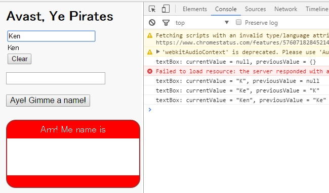

# test-ng2-onchanges
Test Angular2 Dart OnChanges in pirate badge sample.

1. Google original source: in one-hour-codelab  

   * dart-lang/one-hour-codelab/ng2/6-readjsonfile/lib/app_component.dart  
   * dart-lang/one-hour-codelab/ng2/6-readjsonfile/lib/app_component.html  
   * dart-lang/one-hour-codelab/ng2/6-readjsonfile/lib/badge_component.dart  

2. My changed source: in test-ng2-onchanges  

    * dankai23/test-ng2-docheck/lib/app_component.dart  
    * dankai23/test-ng2-docheck/lib/app_component.html  
    * dankai23/test-ng2-docheck/lib/badge_component.dart  

3. How to test
    * change 3 files
    * pub serve
    * set http://localhost:8080 to Chrome Browser
    * push F12 key
    * input name

4. screenshot  
    * 
